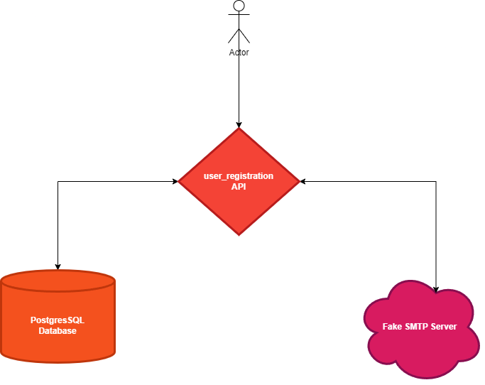

# SXTBootstrap

<b>user_registration</b> is a python 3.10 poetry FastAPI application plugged to a postgresSQL database and a fake SMTP server.

## Getting started

<b>With docker : </b>

Rename/duplicate **.env_sample** to **.env**

`cp .env_sample .env`


In the project repertory
```bash
docker-compose up
```
The api 'll be served to http://127.0.0.1:9000 or http://0.0.0.0:9000 depending on your operating system

The page with the mails 'll be served to http://localhost:8080/

To run the tests

```bash
docker-compose -f test-docker-compose.yml up
```
<b>HTTP collection : </b>

In the <b>docs</b> directory you can find an HTTP collection supported by Insomnia or Postman to request the API 

## Architecture
````
user_registration
 ┣ docs
 ┃ ┗ http_collection.json
 ┣ sql
 ┃ ┗ create_tables.sql
 ┣ user_registration
 ┃ ┣ api
 ┃ ┃ ┣ api_v1
 ┃ ┃ ┃ ┣ endpoints
 ┃ ┃ ┃ ┃ ┣ users.py
 ┃ ┃ ┃ ┃ ┗ __init__.py
 ┃ ┃ ┃ ┣ api.py
 ┃ ┃ ┃ ┗ __init__.py
 ┃ ┃ ┗ __init__.py
 ┃ ┣ core
 ┃ ┃ ┣ config.py
 ┃ ┃ ┣ security.py
 ┃ ┃ ┗ __init__.py
 ┃ ┣ crud
 ┃ ┃ ┣ user.py
 ┃ ┃ ┣ user_activation_code.py
 ┃ ┃ ┗ __init__.py
 ┃ ┣ db
 ┃ ┃ ┣ db_connector.py
 ┃ ┃ ┗ __init__.py
 ┃ ┣ models
 ┃ ┃ ┣ base.py
 ┃ ┃ ┣ user.py
 ┃ ┃ ┣ user_activation_code.py
 ┃ ┃ ┗ __init__.py
 ┃ ┣ schemas
 ┃ ┃ ┣ user.py
 ┃ ┃ ┣ user_activation_code.py
 ┃ ┃ ┗ __init__.py
 ┃ ┣ static
 ┃ ┃ ┗ email_templates
 ┃ ┃ ┃ ┣ build
 ┃ ┃ ┃ ┃ ┗ activation_email.html
 ┃ ┃ ┃ ┗ src
 ┃ ┃ ┃ ┃ ┗ activation_email.mjml
 ┃ ┣ tests
 ┃ ┃ ┣ integration
 ┃ ┃ ┃ ┣ api
 ┃ ┃ ┃ ┃ ┣ api_v1
 ┃ ┃ ┃ ┃ ┃ ┣ test_users.py
 ┃ ┃ ┃ ┃ ┃ ┗ __init__.py
 ┃ ┃ ┃ ┃ ┗ __init__.py
 ┃ ┃ ┃ ┗ __init__.py
 ┃ ┃ ┣ sql
 ┃ ┃ ┃ ┣ user_activation_code_fixture.sql
 ┃ ┃ ┃ ┗ user_fixture.sql
 ┃ ┃ ┣ unit
 ┃ ┃ ┃ ┣ api
 ┃ ┃ ┃ ┃ ┣ api_v1
 ┃ ┃ ┃ ┃ ┃ ┗ __init__.py
 ┃ ┃ ┃ ┃ ┗ __init__.py
 ┃ ┃ ┃ ┣ crud
 ┃ ┃ ┃ ┃ ┣ test_user.py
 ┃ ┃ ┃ ┃ ┣ test_user_activation_code.py
 ┃ ┃ ┃ ┃ ┗ __init__.py
 ┃ ┃ ┃ ┗ __init__.py
 ┃ ┃ ┣ conftest.py
 ┃ ┃ ┗ __init__.py
 ┃ ┣ dependencies.py
 ┃ ┣ utils.py
 ┃ ┗ __init__.py
 ┣ .env_sample
 ┣ .gitignore
 ┣ .gitlab-ci.yml
 ┣ .pre-commit-config.yaml
 ┣ .pylintrc
 ┣ asgi.py
 ┣ CHANGELOG.md
 ┣ CONTRIBUTING.md
 ┣ docker-compose.yml
 ┣ Dockerfile
 ┣ gunicorn_conf.py
 ┣ poetry.lock
 ┣ pyproject.toml
 ┣ README.md
 ┣ test-docker-compose.yml
 ┗ test-Dockerfile
````

